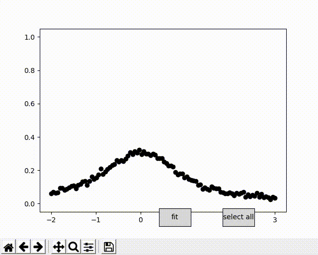

# Curve Fitting GUI

This project provides a graphical interface for the `curve_fit` function of scipy. 
It is relying on `matplotlib` for the GUI.



## Usage 

```python 
import numpy as np
import curve_fit_gui

np.random.seed(12345)
x = np.linspace(-2, 3, num=100)
y_truth = lorentzian(x)
sig = 0.01
noise = sig*np.random.normal(size=x.shape)
y_obs = y_truth + noise
fit_gui = curve_fit_gui(lorentzian, x, y_obs)

plt.show()

```


