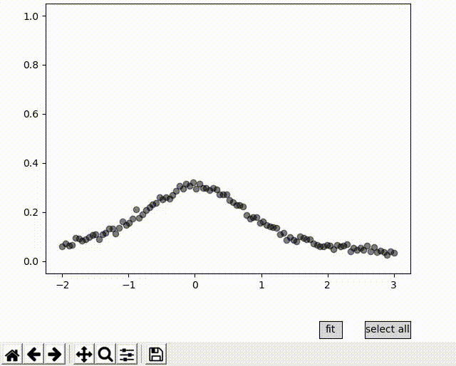

# Curve Fitting GUI

[](https://travis-ci.org/MaximeBouton/curve_fit_gui)

This project provides a graphical interface for the scipy [curve_fit](https://docs.scipy.org/doc/scipy/reference/generated/scipy.optimize.curve_fit.html) function. 
It is relying on [matplotlib](https://matplotlib.org/) for the GUI.


## Usage 

```python 
import numpy as np
import curve_fit_gui

np.random.seed(12345)
x = np.linspace(-2, 3, num=100)
y_truth = lorentzian(x)
sig = 0.01
noise = sig*np.random.normal(size=x.shape)
y_obs = y_truth + noise
fit_gui = curve_fit_gui(lorentzian, x, y_obs)

plt.show()

```



